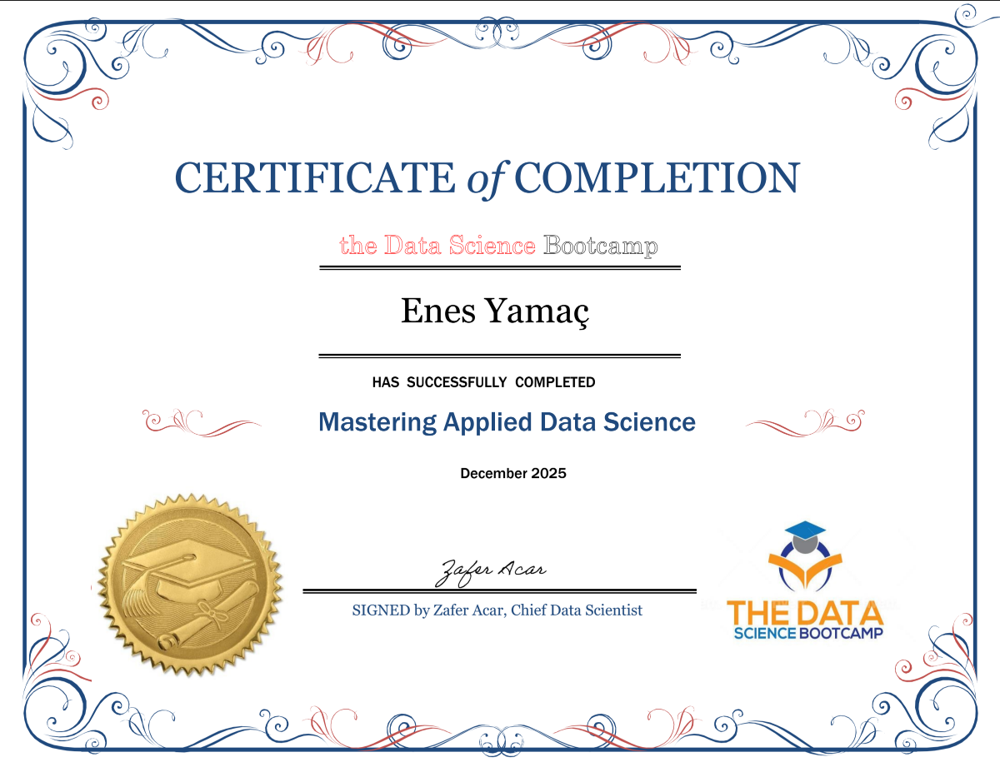

## 🚀 AI & Machine Learning Portfolio — Enes Yamac

Applied AI & ML Developer — Computer Vision · NLP · Forecasting · Recommender Systems · ML Apps

I build end-to-end applied AI/ML projects:

Data → Modeling → Evaluation → Deployment → App

---

🧠 Focus Areas

👁️ Computer Vision

💬 NLP & Text Classification

🎯 Recommender Systems

📈 Time Series Forecasting

🤖 Applied Machine Learning

🖥️ Streamlit & HuggingFace App Deployment

---

## 👤 About Me

I build practical AI \& Machine Learning projects from:

\*\*Data → Model → Evaluation → Deployment → App\*\*

My portfolio contains 50+ applied ML/DL projects including deployed apps, Kaggle notebooks, and HuggingFace Spaces.

## Main focus areas:

\- 🧠 Machine Learning \& Deep Learning

\- 👁️ Computer Vision

\- 💬 NLP \& Text Models

\- 🎯 Recommender Systems

\- 📈 Time Series Forecasting

\- 🖥️ Streamlit & HuggingFace App Deployment

---

\## 🏆 Featured Project Areas

| Area | Examples |

|--------|-------------|

Computer Vision | CNN, Transfer Learning, Segmentation |

NLP | Sentiment Analysis, Text Classification |

Recommenders | Collaborative \& Content-Based |

Time Series | SARIMA, Forecasting Apps |

Applied ML | Prediction \& Risk Models |

Apps | Streamlit \& HuggingFace Spaces |

---

## 🎓 Certification

Data Science & AI Bootcamp
📄 

## 📦 Project Index

👉 Full Repository List:  

See all projects → \*\*Repositories Tab\*\*

Structured lists:

\- 📦 All Projects → \[projects.md](projects.md)

\- 🤗 HuggingFace Apps → \[huggingface.md](huggingface.md)

\- 🧪 Kaggle Notebooks → \[kaggle.md](kaggle.md)

\- 🖥️ Streamlit Apps → \[streamlit-apps.md](streamlit-apps.md)

---

## 🌐 Profiles

\- 💻 GitHub: https://github.com/EnYa32

\- 🤗 HuggingFace: https://huggingface.co/EnYa32

\- 🧪 Kaggle: https://www.kaggle.com/enesyama

---

# 🇩🇪 Kurzprofil (Deutsch)

Ich entwickle praxisnahe AI- und Machine-Learning-Projekte inklusive:

\- Modelltraining

\- Evaluation

\- Feature Engineering

\- Deployment

\- Streamlit Apps

Über 50 Projekte in Computer Vision, NLP, Recommender Systems und Forecasting.

---

# 🇹🇷 Kısa Profil (Türkçe)

Uygulamalı AI ve Machine Learning projeleri geliştiriyorum:

\- Model geliştirme

\- Değerlendirme

\- Tedarik/Sunum

\- Streamlit uygulamaları

50+ proje: Computer Vision, NLP, Tavsiye Sistemleri ve Forecasting.

---

## 📬 Contact

- 💼 LinkedIn: [https://www.linkedin.com/in/enes-yamac-12a5b9387/]
- ✉️ Email: enesyamac3232@outlook.de

Open for AI/ML collaboration and applied projects.
